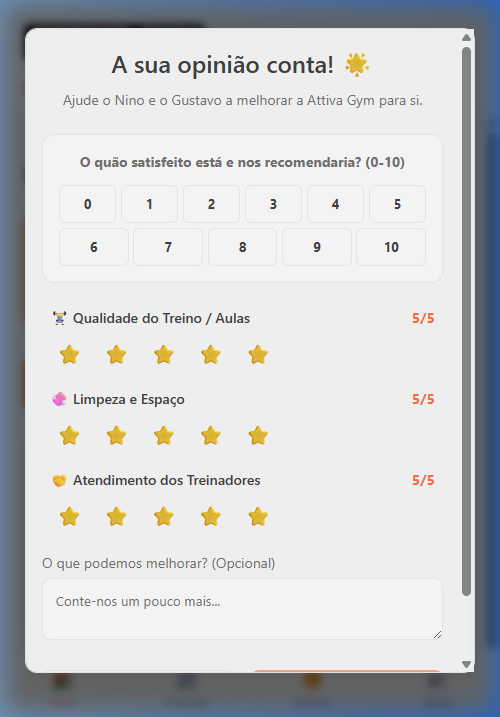

# Attiva Gym - Ecossistema Inteligente de Gestão Fitness 🚀

> **Desenvolvido por Paulo Oliveira**  
> *Solution Architect & AI Orchestrator*

## 📝 Visão Geral do Projeto
O app **Attiva Gym** é uma plataforma SaaS (Software as a Service) de alta performance projetada para uma academia focada em treinamento funcional e público sênior. O desafio era criar uma solução que unisse **eficiência administrativa**, **engajamento de alunos** e **segurança rigorosa de dados**, tudo em uma interface moderna e intuitiva.

## 🧠 Arquitetura e Estratégia
Este projeto foi construído utilizando a metodologia de **Desenvolvimento Dirigido por IA (AI-Driven Development)**. Como Arquiteto da Solução e Orquestrador de IA, minha atuação envolveu:

1.  **Mapeamento de Necessidades:** Tradução dos requisitos de negócio (gestão de turmas, retenção de alunos, gamificação) em uma estrutura técnica escalável.
2.  **Design de Infraestrutura:** Modelagem do banco de dados relacional no Supabase, garantindo integridade e performance.
3.  **Segurança de Dados:** Implementação de **RLS (Row Level Security)** para proteção de dados sensíveis, garantindo conformidade com normas de privacidade.
4.  **Orquestração Técnica:** Comando e supervisão de agentes de IA para implementação de lógica de negócio complexa, migrações de dados e refinamento de UI/UX.

---

## 🛠️ Funcionalidades Principais

### 1. Painel Administrativo (Business Intelligence)
*   **Gestão de Turmas em Tempo Real:** Controle de vagas, presenças e agendamentos inteligentes.
*   **Traceabilidade Total:** Sistema de logs globais que rastreia cada ação administrativa para auditoria.
*   **Alertas de Manutenção:** Notificações automáticas sobre vencimento de seguros, aniversários e inatividades.

### 2. Portal do Aluno (Engajamento e Gamificação)
*   **Ecossistema AttivaCoins:** Sistema de fidelização onde o aluno ganha moedas virtuais por frequência, feedback, entre outros, trocáveis por recompensas reais.
*   **Monitoramento de Evolução:** Gráficos interativos de performance funcional (Força, Equilíbrio, Agilidade).
*   **Feedback Ativo (NPS):** Coleta integrada de satisfação para melhoria contínua do serviço.

### 3. Engenharia e Segurança
*   **Base de Dados:** PostgreSQL via Supabase com autenticação segura.
*   **Frontend:** React + TypeScript com arquitetura de componentes reutilizáveis.
*   **Cloud & Deploy:** Integração contínua via Netlify.
*   **Proteção RLS:** Políticas granulares de acesso ao banco de dados ao nível de linha.

---

## 📸 Galeria Visual
*Interface projetada para máxima usabilidade e estética premium.*

| Visão Administrativa | Portal do Aluno |
|:---:|:---:|
|  |  |
| *Gestão de Turmas e BI* | *Check-in e Engajamento* |
|  |  |
| *Rastreabilidade e Alertas* | *Gamificação e Fidelidade* |

---

## 🚀 Impacto da Solução
O app Attiva Gym transformou a operação manual da academia em um fluxo digital automatizado. A solução não apenas organiza a agenda, mas cria um elo emocional com o aluno através da gamificação, resultando em:
*   **Maior Retenção:** Alunos motivados pelo progresso visível e recompensas.
*   **Decisões Baseadas em Dados:** Dashboards claros que mostram a saúde do negócio em tempo real.
*   **Segurança Institucional:** Proteção total dos dados dos clientes contra acessos não autorizados.

---

> *"Este projeto demonstra o poder da Arquitetura de Soluções moderna: entender a dor do cliente e orquestrar as ferramentas mais avançadas do mundo (IA) para entregar valor real, seguro e encantador."*
> — **Paulo Oliveira**
